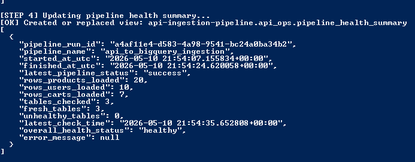
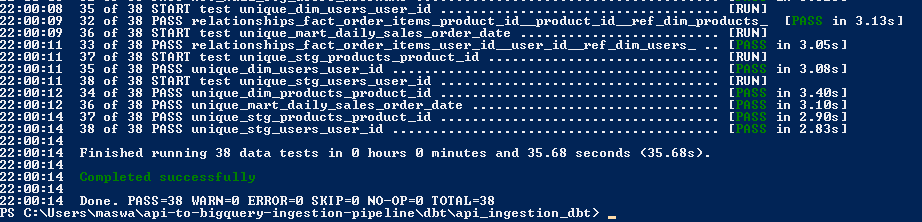
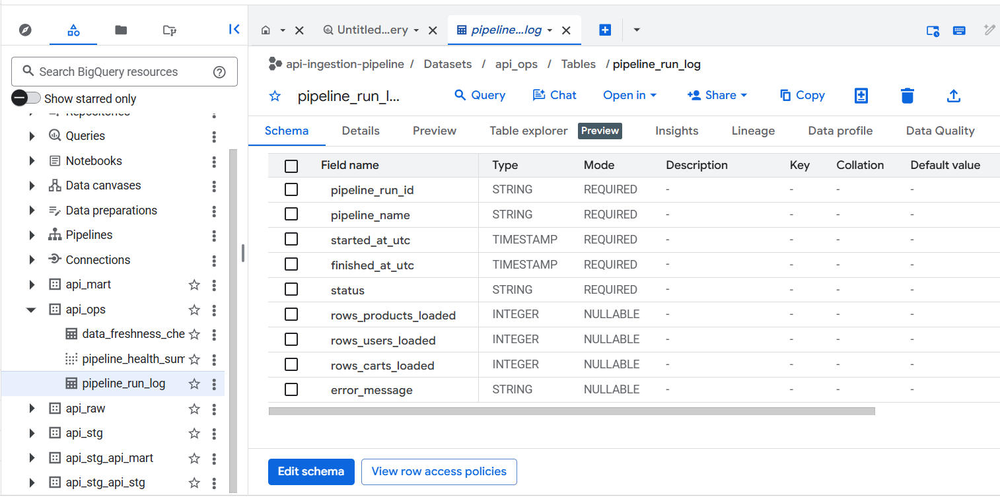
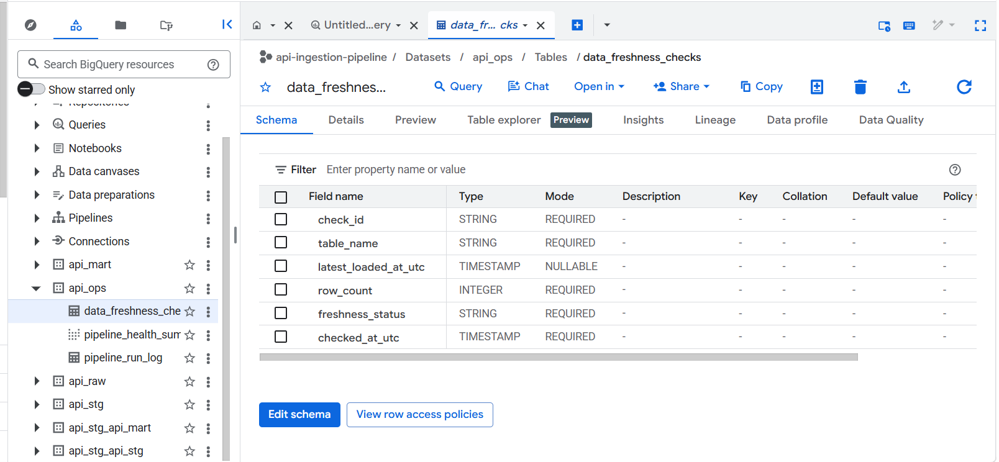
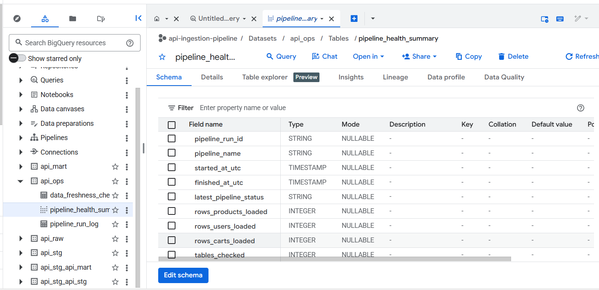
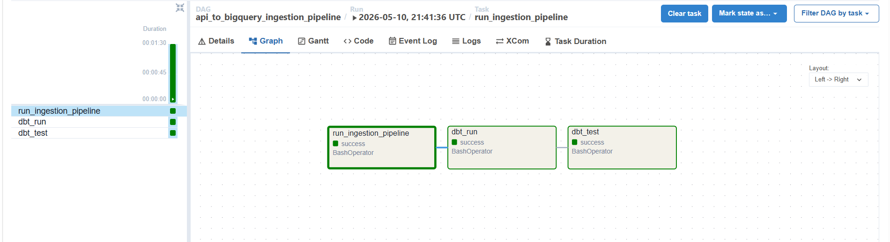
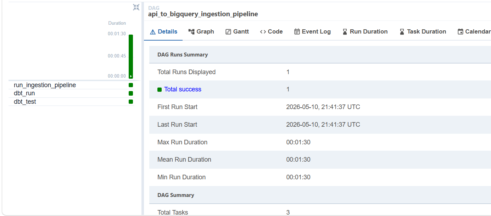

# API-to-BigQuery Ingestion Pipeline
 
An ingestion pipeline that extracts ecommerce API data, lands it in BigQuery with ingestion metadata, transforms it with dbt, and monitors pipeline health through dedicated operational tables, orchestrated with Airflow running locally via Docker.
 
---
 
## Project Overview
 
This project addresses a real and recurring data engineering problem: getting external API data into a warehouse in a way that is reliable, traceable, and testable. Rather than stopping at raw ingestion, it builds the full vertical — raw landing, structured modeling, data quality enforcement, and operational observability — using the same tools and patterns used in production analytics platforms.
 
---
 
## Tech Stack
 
| Layer | Tools |
|---|---|
| Extraction & Loading | Python |
| Data Warehouse | BigQuery |
| Transformation | dbt |
| Orchestration | Airflow running in Docker |
| Containerization | Docker |
| SQL Modeling & Validation | SQL |
 
---
 
## Architecture
 
```
Fake Store API  (/products, /users, /carts)
        ↓
Python extraction
        ↓
Raw JSON landing zone
        ↓
BigQuery raw tables  (with ingestion metadata)
        ↓
Operational monitoring  (run log, freshness checks, health summary)
        ↓
dbt staging models
        ↓
dbt fact / dimension / mart models
        ↓
dbt data tests  (38 passing)
        ↓
Airflow DAG orchestration
```
 
 
 
---
 
## BigQuery Dataset Structure
 
The project separates concerns across four datasets:
 
| Dataset | Purpose |
|---|---|
| `api_raw` | Raw ingested API records with metadata |
| `api_stg` | dbt staging models |
| `api_mart` | dbt fact, dimension, and mart models |
| `api_ops` | Pipeline monitoring tables and health summary |
 
---
 
## Raw Ingestion Layer
 
Each raw table (`raw_products`, `raw_users`, `raw_carts`) stores the original API record alongside ingestion metadata — enabling full traceability from warehouse row back to source file and pipeline run.
 
| Column | Description |
|---|---|
| `raw_record` | Original API response as JSON string |
| `_entity` | Source entity name |
| `_source_endpoint` | API endpoint used |
| `_extracted_at_utc` | Extraction timestamp |
| `_loaded_at_utc` | BigQuery load timestamp |
| `_source_file` | Raw JSON filename |
| `_pipeline_run_id` | Pipeline run identifier |
 
 
 
---
 
## dbt Models
 
Raw records are parsed and modeled into structured, analysis-ready tables.
 
**Staging**
- `stg_products`
- `stg_users`
- `stg_order_items`
**Mart**
- `dim_products`
- `dim_users`
- `fact_order_items` — built at the cart-product grain; joins order items with product prices to calculate item-level revenue
- `mart_daily_sales`
---
 
## Data Quality — 38 Passing Tests
 
dbt tests enforce correctness at every layer:
 
- Not-null and uniqueness checks
- Accepted values validation
- Referential integrity checks
- Custom business-rule tests:
  - `quantity > 0`
  - `item_revenue >= 0`
  - `order_date <= current_date`
```
PASS=38  WARN=0  ERROR=0  TOTAL=38
```
 
 
 
---
 
## Operational Monitoring
 
The pipeline writes structured run data into three BigQuery ops tables, making pipeline health queryable from the warehouse itself.
 
**`api_ops.pipeline_run_log`** — one row per run, capturing:
- Run ID, start/finish timestamps, status
- Rows loaded per source entity
- Error message on failure
  
 
 
**`api_ops.data_freshness_checks`** — per-table freshness tracking:
- Latest load timestamp and row count
- Freshness status per table
  
 
 
**`api_ops.pipeline_health_summary`** — consolidated operational view:
- Latest run status
- Rows loaded per entity
- Count of fresh vs. unhealthy tables
- Overall pipeline health status
  
 
 
### Failure Handling
 
The pipeline includes a controlled failure mode (`FORCE_API_FAILURE=true`) that deliberately calls an invalid endpoint. The failed run is recorded in `pipeline_run_log` with `status = failed`, zero rows, and an error message — verifying that failures surface in the monitoring layer rather than failing silently.
 
---
 
## Airflow DAG
 
Three ordered tasks run the full workflow end-to-end:
 
```
run_ingestion_pipeline → dbt_run → dbt_test
```
 
| Task | Responsibility |
|---|---|
| `run_ingestion_pipeline` | Extracts API data, loads BigQuery raw tables, logs the run, and updates freshness and health checks |
| `dbt_run` | Builds staging, fact, dimension, and mart models |
| `dbt_test` | Runs all 38 dbt data quality tests |
 
 
 
 
 
 
---
 
## Repository Structure
 
```
src/
  config.py
  extract.py
  load_bigquery.py
  pipeline_log.py
  freshness_checks.py
  pipeline_health_summary.py
  run_pipeline.py
 
dbt/
  api_ingestion_dbt/
  profiles.yml
 
airflow/
  dags/
    api_to_bigquery_ingestion_dag.py
 
screenshots/
docker-compose.yml
requirements.txt
README.md
```
 
---
 
## Running Locally
 
### 1. Install dependencies
 
```bash
pip install -r requirements.txt
```
 
### 2. Configure environment variables
 
Create a `.env` file:
 
```env
PROJECT_ID=your-gcp-project-id
LOCATION=US
 
RAW_DATASET=api_raw
STG_DATASET=api_stg
MART_DATASET=api_mart
OPS_DATASET=api_ops
 
GOOGLE_APPLICATION_CREDENTIALS=path/to/service-account-key.json
 
FORCE_API_FAILURE=false
```
 
### 3. Run the ingestion pipeline
 
```bash
python -m src.run_pipeline
```
 
This runs extraction, raw loading, pipeline run logging, freshness checks, and health summary update in sequence.
 
### 4. Run dbt
 
```bash
cd dbt/api_ingestion_dbt
dbt run
dbt test
```
 
### 5. Run Airflow with Docker
 
```bash
docker compose up
```
 
Open `http://localhost:8080` and log in with `admin / admin`. Trigger the `api_to_bigquery_ingestion_pipeline` DAG.
 
Expected task result:
 
```
run_ingestion_pipeline ✅   dbt_run ✅   dbt_test ✅
```
